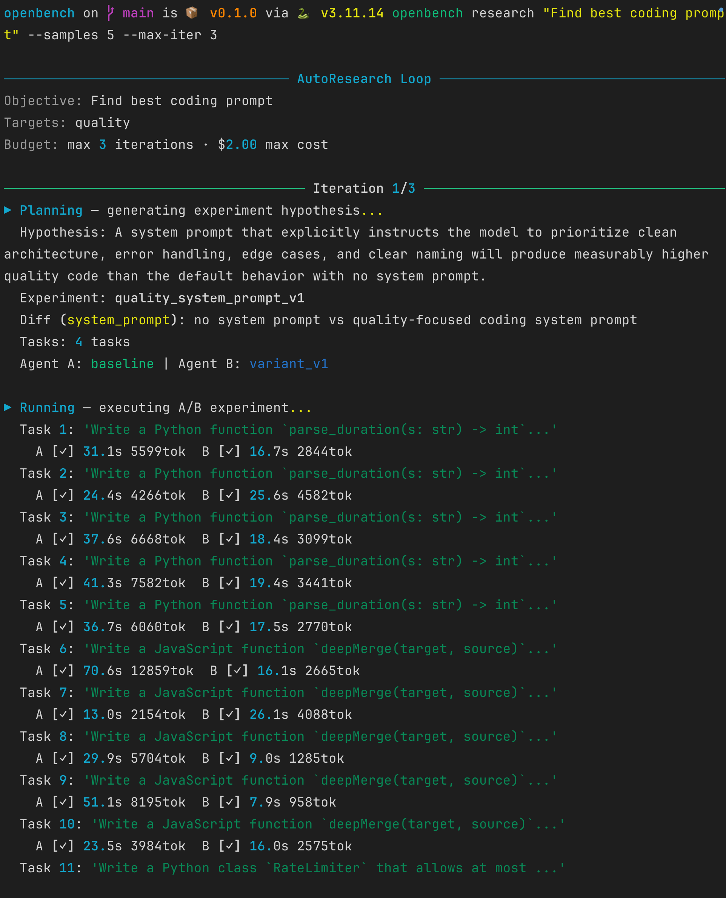
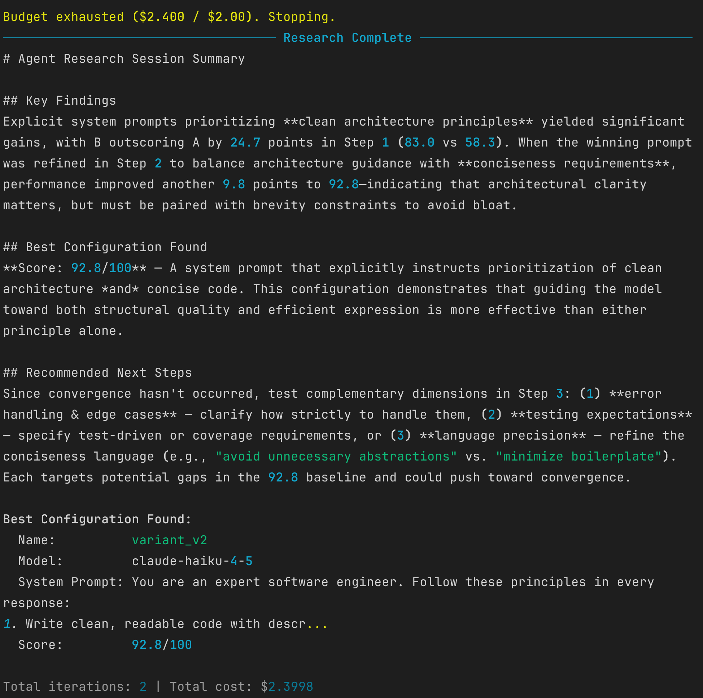

# OpenBench

A/B testing platform for Claude agents. Automates the **plan → run → evaluate → repeat** loop to find optimal agent configurations.

## Preview

| Example 1 | Example 2 |
|:---------:|:---------:|
|  |  |

## Install

```bash
pip install -e .
```

Requires `claude-agent-sdk` (uses Claude Max subscription — no API key needed).

## Usage

```bash
# Run a manually written experiment
openbench run experiments/quicktest_model.py

# Automated research from a natural language goal
openbench research "Find the best system prompt for a concise Q&A assistant" --max-iter 3

# View results
openbench list
openbench compare <experiment-name>
```

## How It Works

1. **Plan** — LLM generates an A/B experiment testing one hypothesis (e.g., system prompt variant)
2. **Run** — Both agents execute every task in isolated temp directories; metrics collected
3. **Evaluate** — LLM judge scores each output on quality, accuracy, conciseness
4. **Repeat** — Winner becomes the new baseline; next hypothesis is proposed

## Key Concepts

- **Experiment**: Two agent configs (`agent_a` vs `agent_b`) differing in exactly **one** variable
- **DiffSpec**: The single variable being tested (`system_prompt`, `model`, `max_turns`, etc.)
- **ResearchProgram**: Natural language objective driving the auto-loop
- Results persist to `results/<experiment-name>/` as JSONL + metadata JSON
- Human-readable reports in `reports/`

## Project Structure

```
src/openbench/     # Core library
experiments/       # Example experiment definitions
programs/          # Saved ResearchProgram JSON configs
results/           # Raw trial data (JSONL)
reports/           # Human-readable experiment reports
docs/              # Guides, memory, plans
```
